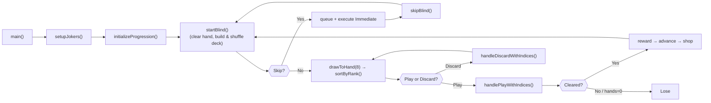
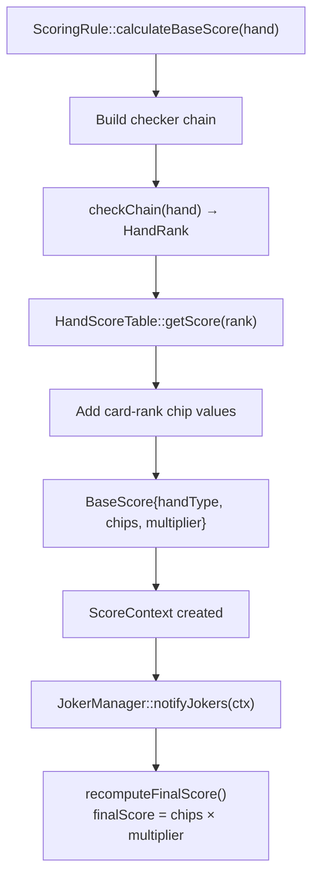
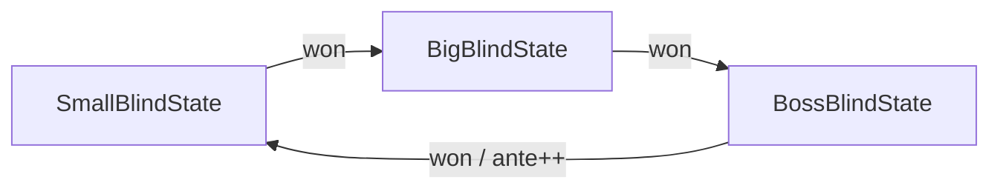
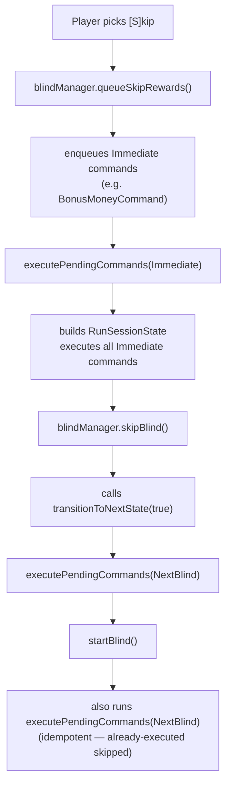
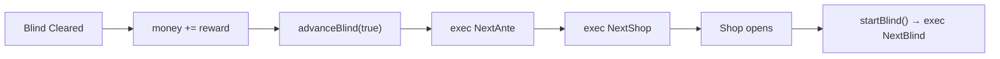

# Technical Documentation

## Overview

Balatro is a C++17 terminal-based poker roguelike. The player draws cards, plays poker hands to meet score thresholds, defeats escalating blinds, earns money, buys jokers from the shop, and progresses through antes. The architecture is modular — each system has its own responsibility and can be extended independently.

**Key design patterns in use:**

| Pattern                     | Where                                                                |
| --------------------------- | -------------------------------------------------------------------- |
| **State Pattern**           | Blind progression (`IBlindState` → Small / Big / Boss)               |
| **Chain of Responsibility** | Poker hand evaluation (checker chain)                                |
| **Command Pattern**         | Skip rewards (`SkipReward::RewardCommand`)                           |
| **Observer Pattern**        | Joker scoring (`IScoreObserver` → `Joker`, Subject = `JokerManager`) |

---

## High-Level Architecture

### System Responsibility Table

| System               | Responsibility                                                                      |
| -------------------- | ----------------------------------------------------------------------------------- |
| `GameManager`        | Controls the overall game flow (session loop, skip prompt, shop entry)              |
| `BlindManager`       | Owns blind states, tracks ante, delegates progression                               |
| `IBlindState`        | Abstract blind — each state defines score req, reward, next transition, skip reward |
| `BlindRule`          | Tracks accumulated score vs required score for the current blind                    |
| `Hand`               | Stores cards held by the player                                                     |
| `ChooseHand`         | Selects or discards cards from the hand by index                                    |
| `HandPlayer`         | Orchestrates PLAY and DISCARD actions (selection → removal → draw → score)          |
| `PokerHandChecker`   | Chain-of-responsibility poker hand detection                                        |
| `ScoringRule`        | Runs the checker chain and calculates base chips + mult                             |
| `ScoreContext`       | Mutable score data used by jokers for modification                                  |
| `JokerManager`       | Subject: owns jokers, notifies all observers on scoring events                      |
| `Shop`               | Displays purchasable jokers after each cleared blind                                |
| `RewardCommandQueue` | Stores deferred skip-reward commands, executes at checkpoints                       |

---

## Runtime Flow



```
main() → GameManager::runSession()
    → setupJokers()                    // clears any existing jokers
    → blindManager.initializeProgression()  // ante=1, SmallBlindState
    → startBlind()                     // clear hand, build & shuffle deck, reset score

    Outer loop (per blind):
        ├─ Skip prompt (if blind allows skipping)
        │    ├─ [S]kip → queueSkipRewards() → executePendingCommands(Immediate)
        │    │        → skipBlind() → executePendingCommands(NextBlind) → startBlind() → continue
        │    └─ [C]ontinue → fall through
        ├─ drawToHand(8)  (replenish to 8 cards, then sortByRank desc)
        ├─ Inner loop (per action):
        │    ├─ Display stats + hand (sorted by rank)
        │    ├─ Prompt for card indices
        │    ├─ [P]lay or [D]iscard selected?
        │    ├─ PLAY  → handlePlayWithIndices() → choose + remove + resolve
        │    │        → blindRule.addScore() → check isBlindCleared()
        │    │        → if not cleared and hands>0: drawToHand(8) + sortByRank(), loop
        │    └─ DISCARD → handleDiscardWithIndices() → remove cards
        │                → discardsRemaining-- → drawToHand(8) + sortByRank(), loop
        │
        ├─ Blind cleared?
        │    ├─ Yes → +reward money → advanceBlind(true)
        │    │       → execute NextAnte → execute NextShop → Shop → startBlind()
        │    └─ No (handsRemaining=0) → Run Ended (Lose)
```

---

## System Flow

The runtime is split into three major stages:

### 1. Session Setup

```
setupJokers() → blindManager.initializeProgression() → startBlind()
```

**`setupJokers()`** — Clears any existing jokers via `jokerManager.clear()`. No starting jokers are registered by default; jokers are acquired through the shop after clearing blinds.

**`blindManager.initializeProgression()`** — Sets `ante = 1`, creates `SmallBlindState(1)`.

**`startBlind()`** — Clears the current hand, rebuilds and shuffles a fresh 52-card deck, resets `handsRemaining = 4`, `discardsRemaining = 3`, resets `BlindRule` accumulated score, displays blind info. Called at the beginning of every blind (including the first).

### 2. Main Gameplay Loop

```
while (handsRemaining > 0):
    ┌─ Display: "Hands: X | Discards: Y | Money: $Z | Score: A / B"
    ├─ Display hand cards with [index] labels
    ├─ Prompt: "Enter card indices (space-separated):"
    ├─ Read indices → parse → validate
    └─ Prompt: "[P]lay selected  [D]iscard selected"
```

### 3. Action Branches

#### PLAY Branch

```
indices → chooseHand.chooseFromHand() → removeCardsFromHand()
         → resolvePlayedHand()
              ├─ checker chain determines HandRank
              ├─ HandScoreTable returns {chips, mult}
              ├─ card ranks add chip values (2-10=face, J/Q/K=10, A=11)
              ├─ ScoreContext created → JokerManager::notifyJokers()
              └─ finalScore = chips × mult
         → blindRule.addScore(score)
         → handsRemaining--
         → drawToHand(8) → sortByRank() (if hands remain)
         → check blindRule.isBlindCleared()
```

#### DISCARD Branch

```
indices → chooseHand.discardFromHand() → discardsRemaining--
        → drawToHand(8) → sortByRank()
```

---

## Card System

### `Card` (defined in `Hand/Hand.h`)

A simple value type. Each card contains:

**Rank** (`Card::Rank`): `TWO(2)` → `ACE(14)`

**Suit** (`Card::Suit`): `HEARTS`, `DIAMONDS`, `CLUBS`, `SPADES`

### Deck

The deck is a `std::vector<Card>` managed directly by `GameManager`:

| Function                | Purpose                                                                                                                                 |
| ----------------------- | --------------------------------------------------------------------------------------------------------------------------------------- |
| `buildAndShuffleDeck()` | Creates 52 cards, shuffles with `std::mt19937`. Called by `startBlind()` at every new blind.                                            |
| `drawToHand(n)`         | Pops cards from the back of `deck` into `currentHand` until hand has `n` cards or deck is empty. Then calls `currentHand.sortByRank()`. |

The deck is rebuilt and reshuffled fresh for every blind (not just once per session).

---

## Hand System

### `Hand` (`Hand/Hand.h`)

Stores the player's current cards as `std::vector<Card>`. Used for both the held hand and played hands.

| Method              | Purpose                               |
| ------------------- | ------------------------------------- |
| `addCard(Card)`     | Add a card                            |
| `removeCard(index)` | Remove card at index                  |
| `getCards()`        | Returns const ref to card vector      |
| `getCardCount()`    | Number of cards                       |
| `clear()`           | Remove all cards                      |
| `sortByRank()`      | Sort cards descending by rank (Ace→2) |

### `ChooseHand` (`Hand/ChooseHand.h`)

Extracts or removes cards from a hand by index.

| Method                           | Purpose                                           |
| -------------------------------- | ------------------------------------------------- |
| `chooseFromHand(hand, indices)`  | Returns a new `Hand` with only the selected cards |
| `discardFromHand(hand, indices)` | Returns a new `Hand` without the discarded cards  |

### `HandPlayer` (`Hand/HandPlayer.h`)

Orchestrates the PLAY/DISCARD pipeline. Two entry points:

| Method                          | Flow                                                          |
| ------------------------------- | ------------------------------------------------------------- |
| `handlePlayWithIndices(...)`    | choose → remove → resolve score → decrement plays → draw back |
| `handleDiscardWithIndices(...)` | discard → decrement discards → draw back                      |

Internal helpers:

- `removeCardsFromHand()` — removes played cards by index (sorted descending)
- `resolvePlayedHand()` — calls `ScoringRule::scoreHand()` then `JokerManager::notifyJokers()`
- `drawToHand()` — draws from deck until hand reaches target count, then calls `sortByRank()`

Cards are always displayed in descending rank order (Ace-high → 2-low) thanks to automatic sorting after every draw.

---

## Poker Hand Evaluation System

### `HandRank` (`Hand/HandRank.h`)

```cpp
enum class HandRank {
    NONE = 0, HIGH_CARD = 1, PAIR = 2, TWO_PAIR = 3,
    THREE_OF_A_KIND = 4, STRAIGHT = 5, FLUSH = 6,
    FULL_HOUSE = 7, FOUR_OF_A_KIND = 8, STRAIGHT_FLUSH = 9,
    ROYAL_FLUSH = 10, FIVE_OF_A_KIND = 11, FLUSH_HOUSE = 12
};
```

### Chain of Responsibility Pattern

Each checker inherits from `PokerHandChecker` and implements `check(const Hand&) → HandRank`. Checkers are linked via `setNext()` into a priority chain:

```
FlushHouseChecker → FiveOfAKindChecker → RoyalFlushChecker
    → StraightFlushChecker → FourOfAKindChecker → FullHouseChecker
    → FlushChecker → StraightChecker → ThreeOfAKindChecker
    → TwoPairChecker → PairChecker → HighCardChecker
```

**How it works:** `checkChain(hand)` calls `check(hand)` on the first checker. If it returns `HandRank::NONE` (not matched), it delegates to `nextChecker->checkChain(hand)`. The first match wins. `HighCardChecker` is the fallback — it always returns `HIGH_CARD`.

### Checker Files (`Hand/Checkers/`)

| File                     | Detects                                           |
| ------------------------ | ------------------------------------------------- |
| `FlushHouseChecker.h`    | Flush + Full House (3+2 of same suit)             |
| `FiveOfAKindChecker.h`   | Five cards of same rank                           |
| `RoyalFlushChecker.h`    | A-K-Q-J-10 all same suit                          |
| `StraightFlushChecker.h` | Five consecutive ranks, same suit                 |
| `FourOfAKindChecker.h`   | Four cards of same rank                           |
| `FullHouseChecker.h`     | Three of a kind + one pair                        |
| `FlushChecker.h`         | Five cards, all same suit                         |
| `StraightChecker.h`      | Five consecutive ranks (includes A-2-3-4-5 wheel) |
| `ThreeOfAKindChecker.h`  | Three cards of same rank                          |
| `TwoPairChecker.h`       | Two different pairs                               |
| `PairChecker.h`          | One pair                                          |
| `HighCardChecker.h`      | Fallback — always matches                         |

### `PokerHandUtils` (`Hand/PokerHandChecker.h`)

Shared analysis utility:

```cpp
struct HandAnalysis {
    size_t cardCount;
    std::array<int, 15> rankCounts;   // counts of each rank 2-14
    std::array<int, 4> suitCounts;    // counts of each suit
    std::vector<int> uniqueRanks;     // sorted unique ranks present
    bool isFlush, isStraight, isWheelStraight;
};
```

Helper: `countRanksWithCount(analysis, n)` — counts how many ranks appear exactly `n` times.

---

## Scoring System



### `ScoringRule` (`Scoring/ScoringRule.h`)

```
calculateBaseScore(hand)
    → Build checker chain
    → checkChain(hand) → HandRank
    → HandScoreTable::getScore(rank) → {chips, mult}
    → Add card-rank chip values (2-10 = face, J/Q/K = 10, A = 11)
    → Return BaseScore{handType, chips, multiplier}
```

### `HandScoreTable` (`Hand/HandScoreTable.h`)

| Hand Type       | Chips | Mult |
| --------------- | ----- | ---- |
| High Card       | 5     | 1    |
| Pair            | 10    | 2    |
| Two Pair        | 20    | 2    |
| Three of a Kind | 30    | 3    |
| Straight        | 30    | 4    |
| Flush           | 35    | 4    |
| Full House      | 40    | 4    |
| Four of a Kind  | 60    | 7    |
| Straight Flush  | 100   | 8    |
| Royal Flush     | 100   | 8    |
| Five of a Kind  | 120   | 12   |
| Flush House     | 140   | 14   |

Score formula: **`finalScore = chips × multiplier`**

### `ScoreContext` (`Scoring/ScoreContext.h`)

Mutable struct passed to jokers:

```cpp
struct ScoreContext {
    const Hand *hand;
    HandRank handType;
    int level = 1;
    int chips;
    int multiplier = 1;
    int finalScore;
};
```

`recomputeFinalScore()` sets `finalScore = chips * multiplier`.

---

## Joker System

### Observer Pattern

Joker scoring uses the **Observer Pattern**:

- **Subject**: `JokerManager` — maintains a list of `IScoreObserver` instances and calls `notifyJokers()` when a hand is scored.
- **Observer**: `Joker` (via `IScoreObserver`) — each joker implements `onScoreCalculated()` to react to scoring events.

This decouples scoring from joker effects: the scoring pipeline fires an event, and all attached jokers independently react.

### `IScoreObserver` (`Scoring/IScoreObserver.h`)

```cpp
class IScoreObserver {
    virtual void onScoreCalculated(ScoreContext &context) = 0;
};
```

### `Joker` (`Joker/Joker.h`)

Abstract observer that also provides joker metadata:

```cpp
class Joker : public IScoreObserver {
    virtual std::string getName() const = 0;
    virtual std::string getDescription(const ScoreContext&) const = 0;
    virtual int getPrice() const = 0;
    // onScoreCalculated() inherited from IScoreObserver
};
```

### `JokerManager` (`Joker/JokerManager.h`)

The **Subject** in the Observer Pattern:

| Method                  | Purpose                                                                            |
| ----------------------- | ---------------------------------------------------------------------------------- |
| `attach(observer)`      | Register a Joker observer to be notified on scoring events                         |
| `notifyJokers(context)` | Calls `onScoreCalculated` on every attached observer, then `recomputeFinalScore()` |
| `clear()`               | Removes all observers                                                              |
| `getJokers()`           | Returns const ref to observer list                                                 |

### Built-in Jokers

| Joker             | Condition        | Effect            | Price |
| ----------------- | ---------------- | ----------------- | ----- |
| `FlatChipJoker`   | Always           | `chips += 20`     | $1    |
| `PairJoker`       | HandRank == PAIR | `multiplier += 4` | $7    |
| `MultiplierJoker` | Always           | `multiplier *= 2` | $7    |

Joker flow: **Base Score → JokerManager::notifyJokers() → each Joker::onScoreCalculated() → recomputeFinalScore()**

---

## Blind State System

### State Pattern

Blind progression uses the **State Pattern** via `IBlindState`. Each blind is an object that defines its own score requirement, reward, skip reward, and transition logic.

### `IBlindState` (`Blind/IBlindState.h`)

```cpp
class IBlindState {
    virtual int getRequiredScore() const = 0;
    virtual int getReward() const = 0;
    virtual const char *getName() const = 0;
    virtual bool canSkip() const = 0;
    virtual void transitionToNextState(BlindManager &, bool blindWon) = 0;
    virtual void queueSkipRewards(SkipReward::RewardCommandQueue &) = 0;
};
```

### Blind Progression Cycle



```
SmallBlindState → BigBlindState → BossBlindState (ante++) → SmallBlindState (next ante)
```

> **Note:** `AnteProgressionState` exists in the codebase (`Ante/`) but is **not wired** into the current progression chain. The Boss blind transitions directly to SmallBlindState after incrementing the ante.

### Per-Blind Values (ante = 1)

| State             | Req Score  | Clear Reward | Can Skip? | Skip Reward      |
| ----------------- | ---------- | ------------ | --------- | ---------------- |
| `SmallBlindState` | 300 × ante | 25 × ante    | Yes       | `+$10` Immediate |
| `BigBlindState`   | 450 × ante | 50 × ante    | Yes       | `+$25` Immediate |
| `BossBlindState`  | 600 × ante | 100 × ante   | **No**    | N/A              |

### `BlindManager` (`Blind/BlindManager.h`)

| Method                               | Purpose                                               |
| ------------------------------------ | ----------------------------------------------------- |
| `initializeProgression()`            | ante=1, SmallBlindState                               |
| `getRequiredScore()` / `getReward()` | Delegates to current state                            |
| `canSkipCurrentBlind()`              | Delegates to current state                            |
| `skipBlind()`                        | Calls `transitionToNextState(true)` — skips the blind |
| `advanceBlind(won)`                  | Calls `transitionToNextState(won)`                    |
| `queueSkipRewards(queue)`            | Delegates to `currentState->queueSkipRewards()`       |
| `incrementAnte()`                    | `ante++` — called by BossBlindState                   |
| `transitionToState(newState)`        | Owns the new state                                    |

### `BlindRule` (`Blind/BlindRule.h`)

Tracks accumulated score against the required score:

| Method                  | Purpose                           |
| ----------------------- | --------------------------------- |
| `setRequiredScore(n)`   | Set the target                    |
| `addScore(n)`           | Add a hand's score to accumulated |
| `getAccumulatedScore()` | Current total                     |
| `isBlindCleared()`      | `accumulated >= required`         |
| `reset()`               | Zero both for next blind          |

---

## Skip Reward Command System

### Why Command Pattern?

Skip rewards have:

- Different effects (money, hands, discards, rerolls)
- Different activation timing (immediate, next blind, next shop, next ante)
- Deferred execution (grant now, activate later)

A single `if/else` or `switch` would not scale. The Command Pattern encapsulates each reward as an independent command object.

### File Inventory (`SkipReward/`)

| File                        | Role                                                                                           |
| --------------------------- | ---------------------------------------------------------------------------------------------- |
| `CommandTiming.h`           | Enum: `Immediate`, `NextBlind`, `NextShop`, `NextAnte`                                         |
| `RunSessionState.h`         | Mutable state snapshot (refs to `handsRemaining`, `discardsRemaining`, `money`, `freeRerolls`) |
| `RewardCommand.h`           | Abstract base: `getName()`, `getDescription()`, `execute(state)`                               |
| `PendingCommand.h`          | Wraps command + timing + `executed` flag                                                       |
| `BonusHandCommand.h`        | `state.remainingPlays += 1`                                                                    |
| `BonusDiscardCommand.h`     | `state.remainingDiscards += 1`                                                                 |
| `FreeRerollCommand.h`       | `state.freeRerolls += 1`                                                                       |
| `BonusMoneyCommand.h`       | `state.currentMoney += N` (configurable constructor)                                           |
| `RewardCommandQueue.h/.cpp` | `enqueue()`, `executeCommandsWithTiming()`, `getPendingCommands()`                             |

### Execution Flow (Skip)



```
Player picks [S]kip
    → blindManager.queueSkipRewards(commandQueue)
         → currentState->queueSkipRewards() enqueues RewardCommands
    → executePendingCommands(Immediate)
         → builds RunSessionState{handsRemaining, discardsRemaining, money, freeRerolls}
         → executes all Immediate-timed commands
    → blindManager.skipBlind()
         → currentState->transitionToNextState(true)
    → executePendingCommands(NextBlind)
    → startBlind()
         → executePendingCommands(NextBlind)  (idempotent — already-marked executed skipped)
```

### Execution Flow (Blind Cleared)



```
Blind cleared
    → money += blindManager.getReward()
    → blindManager.advanceBlind(true)
    → executePendingCommands(NextAnte)
    → executePendingCommands(NextShop)
    → Shop opens
    → startBlind() → executePendingCommands(NextBlind)
```

### Checkpoint Table

| Timing      | Where Executed                              | Purpose                             |
| ----------- | ------------------------------------------- | ----------------------------------- |
| `Immediate` | Skip flow, right after `queueSkipRewards()` | Instant rewards                     |
| `NextBlind` | `startBlind()` — top of method              | Rewards for "next blind"            |
| `NextAnte`  | After `advanceBlind(true)`                  | Rewards triggered by ante increment |
| `NextShop`  | Just before `shop.displayAndHandle()`       | Rewards for shop phase              |

---

## Shop System

### `Shop` (`Shop/Shop.h`)

Appears after every cleared blind. Offers 3 jokers:

| Slot | Joker                          | Price |
| ---- | ------------------------------ | ----- |
| [0]  | `MultiplierJoker` (2× mult)    | $7    |
| [1]  | `FlatChipJoker` (+20 chips)    | $1    |
| [2]  | `PairJoker` (+4 mult on pairs) | $7    |

Player can buy one or skip. Purchased jokers are attached to `JokerManager` via `attach()`.

---

## Extension Guide

### Adding a New Joker

1. **Create a class** inheriting from `Joker` (which implements `IScoreObserver`):

   ```cpp
   // Joker/MyJoker.h
   class MyJoker : public Joker {
       std::string getName() const override { return "My Joker"; }
       std::string getDescription(const ScoreContext&) const override { return "+10 chips"; }
       int getPrice() const override { return 5; }
       void onScoreCalculated(ScoreContext &ctx) override { ctx.chips += 10; }
   };
   ```

2. **Attach** to the Subject in `GameManager::setupJokers()` or add to `Shop::initializeShopJokers()`:
   ```cpp
   jokerManager.attach(std::make_unique<MyJoker>());
   ```

### Adding a New Poker Hand

1. **Add enum value** in `HandRank` (`Hand/HandRank.h`)

2. **Create a checker** in `Hand/Checkers/`:

   ```cpp
   class MyHandChecker : public PokerHandChecker {
       HandRank check(const Hand &hand) override { /* ... */ }
   };
   ```

3. **Insert into the chain** in `ScoringRule::calculateBaseScore()` — stronger hands go earlier

4. **Add score entry** in `HandScoreTable::getScore()`

### Adding a New Blind Type

1. **Create state** inheriting from `IBlindState`:

   ```cpp
   class EliteBlindState : public IBlindState {
       int getRequiredScore() const override { return 800 * ante; }
       int getReward() const override { return 150 * ante; }
       const char *getName() const override { return "Elite Blind"; }
       bool canSkip() const override { return false; }
       void transitionToNextState(BlindManager &m, bool won) override { /* ... */ }
       void queueSkipRewards(SkipReward::RewardCommandQueue &q) override { /* ... */ }
   };
   ```

2. **Wire transitions** — update the `transitionToNextState()` of the blind that should lead into your new state

### Adding a New Skip Reward

1. **Create command** in `SkipReward/`:

   ```cpp
   class DoubleMultCommand : public RewardCommand {
       const char *getName() const override { return "Double Mult"; }
       const char *getDescription() const override { return "2x mult next hand"; }
       void execute(RunSessionState &state) override { /* ... */ }
   };
   ```

2. **Queue from a blind state**:

   ```cpp
   void SmallBlindState::queueSkipRewards(RewardCommandQueue &queue) {
       queue.enqueue(CommandTiming::NextBlind, std::make_unique<DoubleMultCommand>());
   }
   ```

3. **If new state fields are needed**, add to `RunSessionState` and `GameManager`. No changes needed to `RewardCommandQueue` or checkpoint infrastructure.
