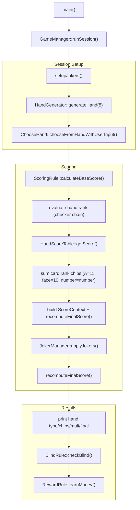

```mermaid
flowchart TD
	main["main()"] --> runSession["GameManager::runSession()"]

	subgraph SessionSetup["Session Setup"]
		setupJokers["setupJokers()"]
		generateHand["HandGenerator::generateHand(8)"]
		chooseHand["ChooseHand::chooseFromHandWithUserInput()"]
	end

	runSession --> setupJokers --> generateHand --> chooseHand

	subgraph Scoring["Scoring"]
		calcBase["ScoringRule::calculateBaseScore()"]
		evalRank["evaluate hand rank (checker chain)"]
		baseTable["HandScoreTable::getScore()"]
		sumCardChips["sum card rank chips (A=11, face=10, number=number)"]
		buildContext["build ScoreContext + recomputeFinalScore()"]
		applyJokers["JokerManager::applyJokers()"]
		recomputeFinal["recomputeFinalScore()"]
	end

	chooseHand --> calcBase
	calcBase --> evalRank --> baseTable --> sumCardChips --> buildContext --> applyJokers --> recomputeFinal

	subgraph Results["Results"]
		printResult["print hand type/chips/mult/final"]
		checkBlind["BlindRule::checkBlind()"]
		reward["RewardRule::earnMoney()"]
	end

	recomputeFinal --> printResult --> checkBlind --> reward
```
