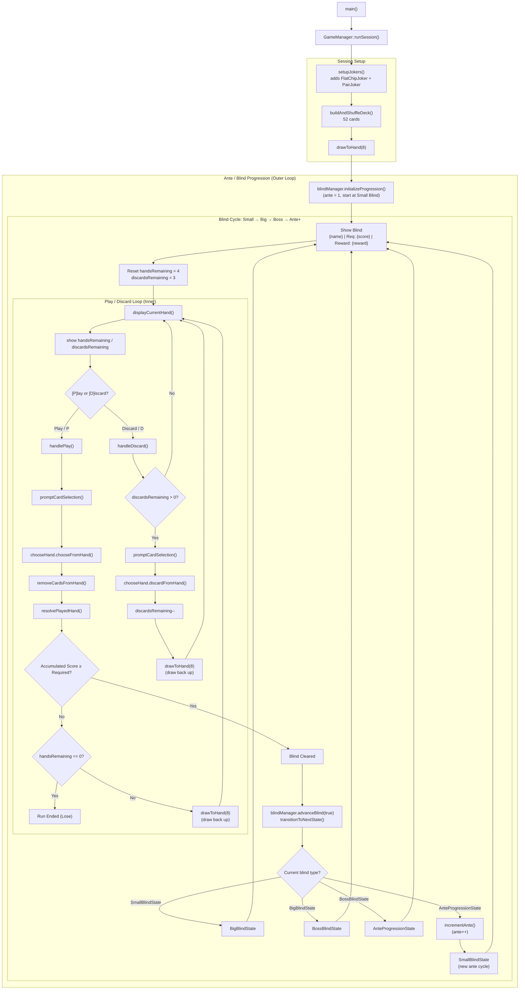

```mermaid
flowchart TD

    main["main()"] --> runSession["GameManager::runSession()"]

    subgraph SessionSetup["Session Setup"]
        setupJokers["setupJokers()<br/>adds FlatChipJoker + PairJoker"]
        buildDeck["buildAndShuffleDeck()<br/>52 cards"]
        drawInitial["drawToHand(8)"]
    end

    runSession --> setupJokers
    setupJokers --> buildDeck
    buildDeck --> drawInitial
    drawInitial --> initBlind

    subgraph AnteProgression["Ante / Blind Progression (Outer Loop)"]

        initBlind["blindManager.initializeProgression()<br/>(ante = 1, start at Small Blind)"]

        subgraph BlindCycle["Blind Cycle: Small → Big → Boss → Ante+"]

            blindInfo["Show Blind<br/>{name} | Req: {score} | Reward: {reward}"]
            resetHands["Reset handsRemaining = 4<br/>discardsRemaining = 3"]

            subgraph PlayDiscardLoop["Play / Discard Loop (Inner)"]

                displayHand["displayCurrentHand()"]
                status["show handsRemaining / discardsRemaining"]

                choice{"[P]lay or [D]iscard?"}

                handlePlay["handlePlay()"]
                handleDiscard["handleDiscard()"]

                promptPlay["promptCardSelection()"]
                promptDiscard["promptCardSelection()"]

                choosePlay["chooseHand.chooseFromHand()"]
                chooseDiscard["chooseHand.discardFromHand()"]

                removeCards["removeCardsFromHand()"]
                scoreResolve["resolvePlayedHand()"]

                blindCleared{"Accumulated Score ≥ Required?"}

                decHandsRemaining{"handsRemaining == 0?"}
				endLose["Run Ended (Lose)"]
                decDiscards{"discardsRemaining > 0?"}

                discardDraw["drawToHand(8)<br/>(draw back up)"]
                playDraw["drawToHand(8)<br/>(draw back up)"]
                decDisc["discardsRemaining--"]


            end

            blindComplete["Blind Cleared"]
            advanceBlind["blindManager.advanceBlind(true)<br/>transitionToNextState()"]

            decBlindType{"Current blind type?"}

            toBig["BigBlindState"]
            toBoss["BossBlindState"]
            toAnte["AnteProgressionState"]
            incAnte["incrementAnte()<br/>(ante++)"]
            toSmall["SmallBlindState<br/>(new ante cycle)"]

        end

        %% Blind cycle start
        initBlind --> blindInfo
        blindInfo --> resetHands
        resetHands --> displayHand

        %% Main loop
        displayHand --> status
        status --> choice

        %% Play branch
        choice -- Play / P --> handlePlay
        handlePlay --> promptPlay
        promptPlay --> choosePlay
        choosePlay --> removeCards
        removeCards --> scoreResolve
        scoreResolve --> blindCleared

        blindCleared -- Yes --> blindComplete
        blindComplete --> advanceBlind

        blindCleared -- No --> decHandsRemaining
        decHandsRemaining -- Yes --> endLose
        decHandsRemaining -- No --> playDraw
        playDraw --> displayHand

        %% Discard branch
        choice -- Discard / D --> handleDiscard
        handleDiscard --> decDiscards

        decDiscards -- No --> displayHand
        decDiscards -- Yes --> promptDiscard

        promptDiscard --> chooseDiscard
        chooseDiscard --> decDisc
        decDisc --> discardDraw
        discardDraw --> displayHand

        %% Blind state transitions
        advanceBlind --> decBlindType

        decBlindType -- SmallBlindState --> toBig
        decBlindType -- BigBlindState --> toBoss
        decBlindType -- BossBlindState --> toAnte

        decBlindType -- AnteProgressionState --> incAnte
        incAnte --> toSmall

        toBig --> blindInfo
        toBoss --> blindInfo
        toAnte --> blindInfo
        toSmall --> blindInfo

    end
```
