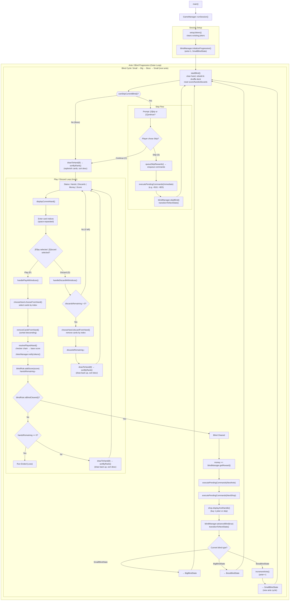

```mermaid
flowchart TD

    main["main()"] --> runSession["GameManager::runSession()"]

    subgraph SessionSetup["Session Setup"]
        setupJokers["setupJokers()<br/>clears existing jokers"]
        initBlind["blindManager.initializeProgression()<br/>(ante=1, SmallBlindState)"]
    end

    runSession --> setupJokers
    setupJokers --> initBlind

    subgraph AnteProgression["Ante / Blind Progression (Outer Loop)"]

        subgraph BlindCycle["Blind Cycle: Small → Big → Boss → Small (next ante)"]

            startB["startBlind()<br/>clear hand, rebuild & shuffle deck<br/>reset score/hands/discards"]
            skipCheck{{"canSkipCurrentBlind()?"}}

            subgraph SkipFlow["Skip Flow"]
                skipPrompt["Prompt: [S]kip or [C]ontinue?"]
                skipChosen{"Player chose Skip?"}
                queueRewards["queueSkipRewards() → enqueue commands"]
                execImmediate["executePendingCommands(Immediate)<br/>(e.g. +$10, +$25)"]
                doSkip["blindManager.skipBlind()<br/>transitionToNextState()"]
            end

            drawFull["drawToHand(8) → sortByRank()<br/>(replenish cards, sort desc)"]

            subgraph PlayDiscardLoop["Play / Discard Loop (Inner)"]

                status["Status: Hands | Discards | Money | Score"]
                displayHand["displayCurrentHand()"]
                promptIndices["Enter card indices<br/>(space-separated)"]

                choice{"[P]lay selected  [D]iscard selected?"}

                handlePlay["handlePlayWithIndices()"]
                handleDiscard["handleDiscardWithIndices()"]

                choosePlay["chooseHand.chooseFromHand()<br/>select cards by index"]
                chooseDiscard["chooseHand.discardFromHand()<br/>remove cards by index"]

                removeCards["removeCardsFromHand()<br/>(sorted descending)"]
                scoreResolve["resolvePlayedHand()<br/>checker chain → base score<br/>→ JokerManager.notifyJokers()"]
                addScore["blindRule.addScore(score)<br/>handsRemaining--"]

                blindCleared{"blindRule.isBlindCleared()?"}

                decHandsRemaining{"handsRemaining == 0?"}
                endLose["Run Ended (Lose)"]

                decDiscards{"discardsRemaining > 0?"}
                decDisc["discardsRemaining--"]

                playDraw["drawToHand(8) → sortByRank()<br/>(draw back up, sort desc)"]
                discardDraw["drawToHand(8) → sortByRank()<br/>(draw back up, sort desc)"]

            end

            blindComplete["Blind Cleared"]
            collectReward["money += blindManager.getReward()"]
            execAnte["executePendingCommands(NextAnte)"]
            execShop["executePendingCommands(NextShop)"]
            showShop["shop.displayAndHandle()<br/>(buy 1 joker or skip)"]
            advanceBlind["blindManager.advanceBlind(true)<br/>transitionToNextState()"]

            decBlindType{"Current blind type?"}

            toBig["→ BigBlindState"]
            toBoss["→ BossBlindState"]
            incAnte["incrementAnte()<br/>(ante++)"]
            toSmall["→ SmallBlindState<br/>(new ante cycle)"]

        end

        %% Session start → first blind
        initBlind --> startB

        %% startBlind: reset score, set required, execute NextBlind commands
        startB --> skipCheck

        %% Skip branch — only for Small/Big blinds
        skipCheck -- Yes --> skipPrompt
        skipPrompt --> skipChosen
        skipChosen -- Skip (S) --> queueRewards
        queueRewards --> execImmediate
        execImmediate --> doSkip
        doSkip --> startB

        skipChosen -- Continue (C) --> drawFull
        skipCheck -- No (Boss) --> drawFull

        %% Inner loop
        drawFull --> status
        status --> displayHand
        displayHand --> promptIndices
        promptIndices --> choice

        %% Play branch
        choice -- Play (P) --> handlePlay
        handlePlay --> choosePlay
        choosePlay --> removeCards
        removeCards --> scoreResolve
        scoreResolve --> addScore
        addScore --> blindCleared

        blindCleared -- Yes --> blindComplete
        blindComplete --> collectReward
        collectReward --> execAnte
        execAnte --> execShop
        execShop --> showShop
        showShop --> advanceBlind

        blindCleared -- No --> decHandsRemaining
        decHandsRemaining -- Yes --> endLose
        decHandsRemaining -- No --> playDraw
        playDraw --> status

        %% Discard branch
        choice -- Discard (D) --> handleDiscard
        handleDiscard --> decDiscards

        decDiscards -- No (0 left) --> status
        decDiscards -- Yes --> chooseDiscard
        chooseDiscard --> decDisc
        decDisc --> discardDraw
        discardDraw --> status

        %% Blind state transitions
        advanceBlind --> decBlindType

        decBlindType -- SmallBlindState --> toBig
        decBlindType -- BigBlindState --> toBoss
        decBlindType -- BossBlindState --> incAnte
        incAnte --> toSmall

        toBig --> startB
        toBoss --> startB
        toSmall --> startB

    end
```
