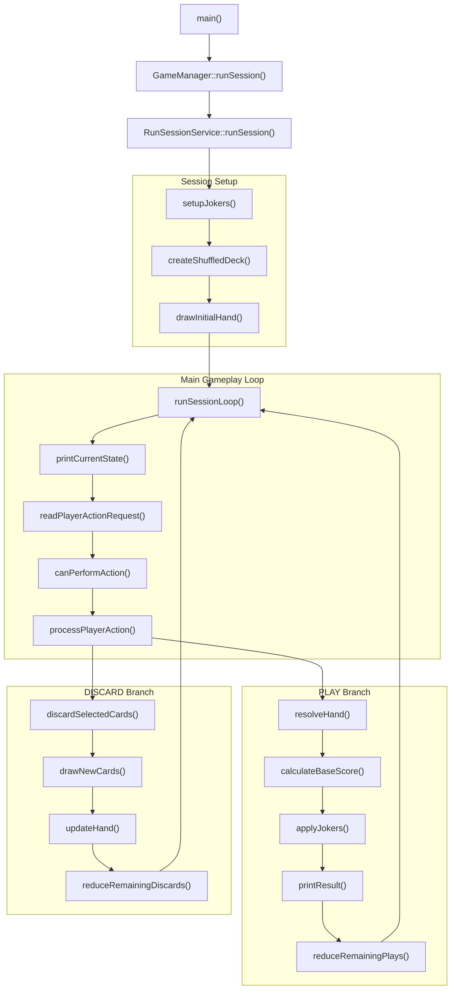

```mermaid
flowchart TD
	main["main()"] --> runSession["GameManager::runSession()"]
	runSession --> runService["RunSessionService::runSession()"]

	subgraph SessionSetup["Session Setup"]
		setupJokers["setupJokers()"]
		createDeck["createShuffledDeck()"]
		drawInitial["drawInitialHand()"]
	end

	runService --> setupJokers --> createDeck --> drawInitial

	subgraph MainLoop["Main Gameplay Loop"]
		loopStart["runSessionLoop()"]
		printState["printCurrentState()"]
		readAction["readPlayerActionRequest()"]
		validateAction["canPerformAction()"]
		processAction["processPlayerAction()"]
	end

	drawInitial --> loopStart
	loopStart --> printState --> readAction --> validateAction --> processAction

	subgraph PlayBranch["PLAY Branch"]
		resolveHand["resolveHand()"]
		baseScore["calculateBaseScore()"]
		applyJokers["applyJokers()"]
		printResult["printResult()"]
		reducePlays["reduceRemainingPlays()"]
	end

	subgraph DiscardBranch["DISCARD Branch"]
		discardCards["discardSelectedCards()"]
		drawNew["drawNewCards()"]
		updateHand["updateHand()"]
		reduceDiscards["reduceRemainingDiscards()"]
	end

	processAction --> resolveHand
	processAction --> discardCards

	resolveHand --> baseScore --> applyJokers --> printResult --> reducePlays --> loopStart
	discardCards --> drawNew --> updateHand --> reduceDiscards --> loopStart
```
