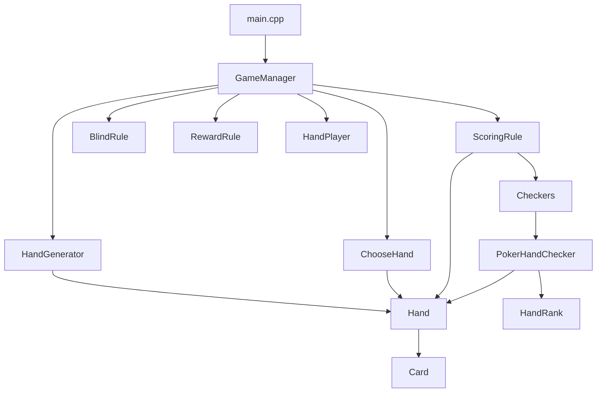

```mermaid
flowchart TD
	main["main.cpp"] --> GameManager

	GameManager --> HandGenerator
	GameManager --> ChooseHand
	GameManager --> ScoringRule
	GameManager --> BlindRule
	GameManager --> RewardRule
	GameManager --> HandPlayer

	HandGenerator --> Hand
	ChooseHand --> Hand
	ScoringRule --> Hand

	ScoringRule --> Checkers
	Checkers --> PokerHandChecker
	PokerHandChecker --> Hand
	PokerHandChecker --> HandRank

	Hand --> Card
```
