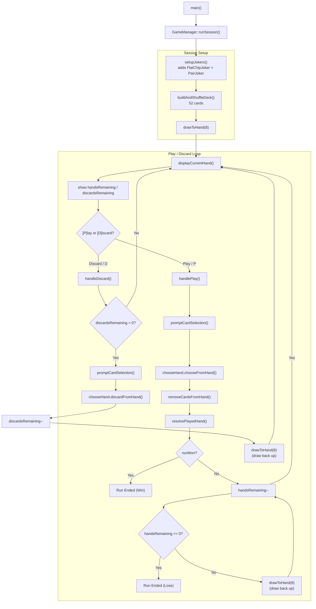

```mermaid
flowchart TD
	main["main()"] --> runSession["GameManager::runSession()"]

	subgraph SessionSetup["Session Setup"]
		setupJokers["setupJokers()\nadds FlatChipJoker + PairJoker"]
		buildDeck["buildAndShuffleDeck()\n52 cards"]
		drawInitial["drawToHand(8)"]
	end

	runSession --> setupJokers --> buildDeck --> drawInitial

	subgraph PlayDiscardLoop["Play / Discard Loop"]
		displayHand["displayCurrentHand()"]
		status["show handsRemaining / discardsRemaining"]
		choice{"[P]lay or [D]iscard?"}
		handlePlay["handlePlay()"]
		handleDiscard["handleDiscard()"]
		promptPlay["promptCardSelection()"]
		promptDiscard["promptCardSelection()"]
		choosePlay["chooseHand.chooseFromHand()"]
		chooseDiscard["chooseHand.discardFromHand()"]
		removeCards["removeCardsFromHand()"]
		scoreResolve["resolvePlayedHand()"]
		decWin{"runWon?"}
		decHandsRemaining{"handsRemaining == 0?"}
		endWin["Run Ended (Win)"]
		endLose["Run Ended (Lose)"]
		decDiscards{"discardsRemaining > 0?"}
		discardDraw["drawToHand(8)\n(draw back up)"]
		playDraw["drawToHand(8)\n(draw back up)"]
		decHands{"handsRemaining > 0?"}
	end

	drawInitial --> displayHand --> status --> choice
	choice -- "Play / P" --> handlePlay
	choice -- "Discard / D" --> handleDiscard

	%% Play path
	handlePlay --> promptPlay --> choosePlay --> removeCards --> scoreResolve --> decWin
	decWin -- "Yes" --> endWin
	decWin -- "No" --> decHands["handsRemaining--"] --> decHandsRemaining
	decHandsRemaining -- "Yes" --> endLose
	decHandsRemaining -- "No" --> playDraw --> decHands
	decHands -- "Yes" --> displayHand

	%% Discard path
	handleDiscard --> decDiscards
	decDiscards -- "No" --> displayHand
	decDiscards -- "Yes" --> promptDiscard --> chooseDiscard --> decDisc["discardsRemaining--"] --> discardDraw --> displayHand
```
